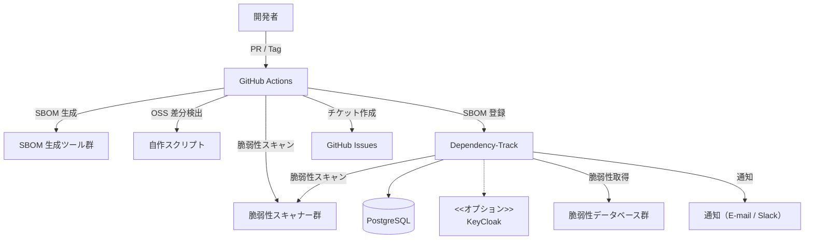
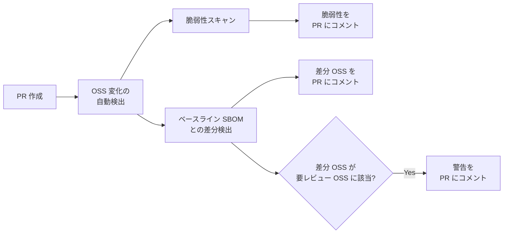
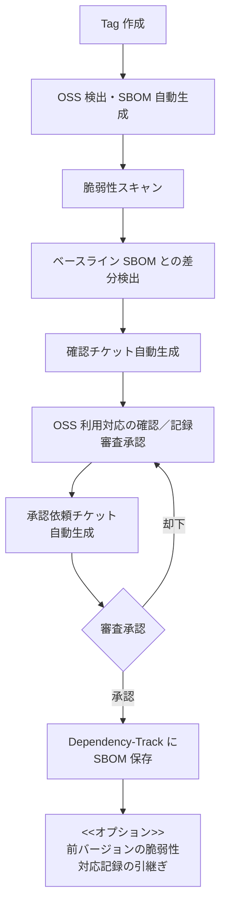

# slim-sbom-flow

低コストで構築・運用できる OSS 管理システム

## 目次

- [このリポジトリで提供するもの](#このリポジトリで提供するもの)
- [目的](#目的)
- [背景](#背景)
- [ユースケース](#ユースケース)
  - [1. 脆弱性管理の自動化](#1-脆弱性管理の自動化)
  - [2. SBOM の生成・管理](#2-sbom-の生成管理)
  - [3. 利用する OSS を管理する](#3-利用する-oss-を管理する)
- [システム構成](#システム構成)
  - [構成図](#構成図)
  - [基本ツール](#基本ツール)
  - [モジュール特性に合わせて選択するツール](#モジュール特性に合わせて選択するツール)
  - [オプションツール](#オプションツール)
- [ワークフロー](#ワークフロー)
  - [PR 作成時のワークフロー](#pr-作成時のワークフロー)
  - [Tag 作成時のワークフロー](#tag-作成時のワークフロー)
- [運用監視](#運用監視)
- [よくある質問と設計判断](FAQ.md)
- [セットアップ方法](SETUP.md)

---

## このリポジトリで提供するもの

他の組織がすぐに OSS 管理システムを構築できるように、以下を提供します。

- **セットアップ手順書**: Dependency-Track、GitHub Actions の構築手順
  - ✅ [docs/dependency-track-setup.md](docs/dependency-track-setup.md) - Dependency-Track 構築手順書
  - ✅ [docs/oidc-setup-keycloak.md](docs/oidc-setup-keycloak.md) - OIDC 連携（Keycloak）セットアップガイド
  - ✅ [SETUP.md](SETUP.md) - 全体のセットアップガイド
- **Docker Compose**: Dependency-Track の構成テンプレート
  - ✅ [docker-compose/basic/docker-compose.yml](docker-compose/basic/docker-compose.yml) - 基本構成（小規模チーム向け）
  - ✅ [docker-compose/oidc/docker-compose.yml](docker-compose/oidc/docker-compose.yml) - OIDC 連携構成（中規模以上向け）
- **GitHub Actions ワークフロー**: PR/Tag 作成時の自動チェック用（実装中）
- **TypeScript スクリプト**: OSS 差分検出、Issue 自動生成（実装中）
- **設定ファイルテンプレート**: 要レビュー OSS の定義、ポリシー設定（実装中）

**※ 一部実装中です。完成次第、上記ファイルを順次追加します。**

## 目的

以下のポイントを満たす OSS 管理システムを構築します。

- **低コスト** で構築・運用できる
- OSS 管理の知識がなくても **すぐに始められる**
- 各プロダクトの特性に応じて **ツールの選択やスクリプトの拡張** ができる

## 背景

CRA 対応によって、SBOM (Software Bill of Materials) の管理が重要になりました。
また、脆弱性管理（OSS の脆弱性検知や、脆弱性対策スピード）の重要性も高まっています。

残念ながら、私たちの会社には OSS 管理システムの構築に必要な知識やスキルをもつ人員がいません。

商用ツールの購入で全て解決できると思うかもしれませんが、現実には:

- 高価な商用ツールを購入しても、現場に合わせたカスタマイズや運用管理は必要です
- 各開発チームに高価な商用ツールのライセンスを割り当てる必要はないかもしれません
  - GitHub Actions やすばらしい OSS で十分かつ容易に対応できる可能性があります
- 商用ツールでも対応できない領域があります
  - パッケージマネージャを利用しない C/C++ モジュールの SBOM 自動生成は商用ツールでも困難です
  - 不正確な SBOM をそのまま運用すると、使っていない OSS を利用中と誤認したり、実際の脆弱性を見逃します

### 既存の OSS ツールと本プロジェクトの違い

Trivy、Syft、Grype、Dependency-Track など、個別のツールは素晴らしく、多くの情報も公開されています。しかし、これらを組み合わせて**実践レベルで包括的な管理システムを構築する方法**は、まとまった形では提供されていません。

- 各ツールの使い方を説明するブログ記事は多数存在します
- 部分的な統合例（GitHub Actions + Dependency-Track など）も存在します
- しかし、**すぐに使える形で、手順書・スクリプト・ワークフロー・承認フロー・監査証跡までを含む包括的なシステム**は見つかりませんでした

本プロジェクトは、OSS 管理の知識がない組織でも、すぐに実践レベルのシステムを構築できることを目指しています。

## ユースケース

### 1. 脆弱性管理の自動化

1. 利用している OSS を脆弱性管理システムに登録する
2. 利用している OSS の脆弱性を通知する
3. 通知された脆弱性の対応結果を記録する
4. 新しいバージョンをリリースした後に、過去のバージョンでの脆弱性の対応記録を引き継ぐ

### 2. SBOM の生成・管理

1. 新しくリリースするソフトウェアの SBOM を生成する
2. OSS を利用するために必要な対応をする
3. SBOM の編集をする（情報の補正、前回リリースしたバージョンの SBOM からの情報の引継ぎを含む）
4. SBOM の審査承認（OSS を利用するための対応の妥当性、残存する脆弱性の有無の確認）をする

### 3. 利用する OSS を管理する

1. 組織として注意しておきたい OSS の利用を管理する
2. 開発中に、想定していないライセンスを持つ OSS の混入や、更新後に残存する OSS の脆弱性を検知する
3. (オプション) 利用している OSS の EOL を検知する

## システム構成

このシステムは GitHub Actions を起点とし、Dependency-Track を中心に据えた構成です。開発者の PR/Tag 作成をトリガーに SBOM を自動生成し、脆弱性スキャンと差分検出を行います。検出結果は PR コメントや Issue として可視化され、承認後に Dependency-Track へ登録されます。Dependency-Track は継続的に脆弱性データベースを監視し、新たな脆弱性を通知します。

### 構成図

### 基本ツール

| ツール | 用途 |
|---|---|
| **Dependency-Track** | 脆弱性管理ダッシュボード |
| **PostgreSQL** | Dependency-Track のデータ管理 |
| **Docker / Docker Compose** | Dependency-Track、PostgreSQL、Trivy、KeyCloak の実行環境 |
| **GitHub Actions** | SBOM 生成、PR コメント投稿、Issue 作成、Dependency-Track への SBOM 登録 |
| **Trivy** | SBOM 生成、OSS 脆弱性検出（Dependency-Track 連携含む） |
| **TypeScript スクリプト** | OSS 更新差分の検出、GitHub Issue の作成補助 |

### モジュール特性に合わせて選択するツール

| ツール | 用途 | 対象 |
|---|---|---|
| **Syft** | SBOM 生成 | パッケージマネージャ利用プロジェクト |
| **Grype** | 脆弱性検出 | パッケージマネージャ利用プロジェクト |
| **ScanCode Toolkit** | ライセンス・著作権の抽出 | C/C++（パッケージマネージャ未使用） |
| **Bear** | 動的・静的リンク情報の収集 | C/C++（パッケージマネージャ未使用） |
| **AI Agent (Agent Skills)** | ScanCode・Bear の結果から SBOM 作成 | C/C++（パッケージマネージャ未使用） |

### オプションツール

| ツール | 用途 |
|---|---|
| **KeyCloak** | Dependency-Track のユーザ管理・認証（OIDC 連携の一例） |
| **Xeol** | EOL の検知（EOL 検出精度に限界あり） |

## 認証と権限

以下の方針で、システムの利用者と権限を管理できます。

- 小規模（単一チーム）では Dependency-Track の基本認証で開始できます
- 中規模以上では OIDC 連携を推奨します（KeyCloak / Entra ID など）
- GitHub Actions が利用する Web API トークンと、UI ログインユーザの権限を分離できます
- ユーザグループごとに閲覧・操作できるプロジェクトを制限できます

## ワークフロー

このシステムは、PR 作成時の早期チェックと Tag 作成時の正式承認という 2 段階のワークフローで OSS を管理します。GitHub Actions の脆弱性スキャンは PR/Tag 作成時のみ実行し、継続的な脆弱性監視は Dependency-Track が担当します。CVSS スコアや特定ライセンスによる自動ブロックは行わず、最終判断は人が行う設計です。承認記録と差分検出結果は GitHub Issue と Actions Artifact で保存し、監査証跡として利用できます。

### PR 作成時のワークフロー

開発中に以下の確認ができます。
- 想定していない OSS を追加・削除・変更されていないか
  - プロダクトが直接利用する OSS だけではなく、その OSS が依存する OSS の確認も含む
- 追加しようとしている OSS が要レビュー対象か
  - 要レビュー OSS は、組織に合わせて設定ファイルで定義できる
- 追加・更新予定の OSS に重大な脆弱性が残っていないか

**ワークフロー詳細:**

**使用ツール:** GitHub Actions, Trivy / Syft, OSS 差分検出スクリプト, Dependency-Track

### Tag 作成時のワークフロー

リリース前には、以下の項目についての審査承認ができます。

**共通チェック:**
- ライセンス種別の確認（判断基準は「ライセンス名」ではなく「利用形態」: 配布形式、改変の有無、リンク方法、地政学リスク等）
- 意図しないバージョンアップや OSS の混入がないか

**個別対応の確認:**
- NOTICE ファイルの同梱、ライセンス情報の提示場所（URL 等）
- リンク方法や改変有無に応じた対応とそのエビデンス
- 残存する脆弱性に対するリスクが許容範囲か

承認フローは GitHub Issue ベースで運用し、複雑な要件（複数承認者の並行承認等）が必要な場合は各組織でカスタマイズできます。

**ワークフロー詳細:**

**使用ツール:** GitHub Actions, Trivy / Syft, OSS 差分検出スクリプト, Dependency-Track

## 運用監視

### 脆弱性管理

Dependency-Track を中心とした継続的な脆弱性監視を行います。

| 機能 | 説明 | 実現ツール |
|---|---|---|
| 脆弱性検知 | さまざまな脆弱性データベース（GitHub Advisories, OSV, OSS Index, NVD）を利用して脆弱性を検出 | Dependency-Track |
| 可視化 | プロジェクトで利用している OSS と脆弱性の一覧表示 | Dependency-Track |
| 脆弱性通知 | 新たに検出された脆弱性を E-mail / Slack で通知 | Dependency-Track |
| 対応記録 | 検出された脆弱性の対応状況を記録・追跡 | Dependency-Track |
| 監査証跡 | 承認記録と SBOM 差分を保存 | GitHub Issue / Actions Artifact |

### EOL の検出

Xeol と GitHub Actions を利用して、利用している OSS の EOL を定期的に確認します。
- EOL を検出したら、Slack で通知します
- Xeol は endoflife.date に依存するため、EOL の検出には限界があります

---

## 関連ドキュメント

- **[よくある質問と設計判断](FAQ.md)** - 設計時に検討した項目と判断結果
- **[セットアップ方法](SETUP.md)** - システムの構築手順（実装予定）
