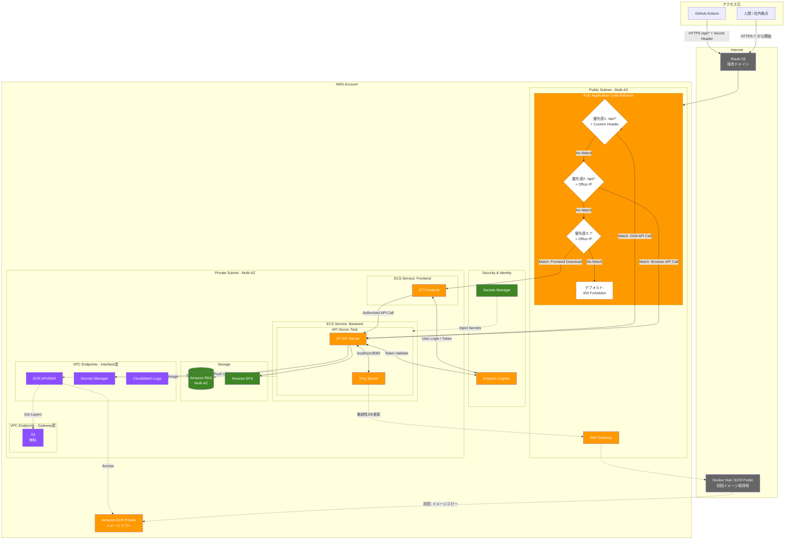

# AWS を利用したシステム構成

このドキュメントでは、AWS を利用した運用可能なシステム構成を紹介します。

実際にシステムを構築する場合は、
[AWS へデプロイするための Terraform 設定](/terraform/README.md)を参照してください。

## システム構成

以下のようにシステムを構成します。

- 負荷に応じてシステムの性能を調整できるように、アプリケーション、データベース、ストレージを分離します
  - アプリケーションは ECS (Fargate) 上にデプロイします
  - データベースには RDS を利用します
  - DT や Trivy Server の使うストレージとして EFS を利用します
- OIDC 準拠の認証基盤を効率的に運用ができるように Cognito を利用します
- 以下を実現するために ALB を配置します
  - 想定していないクライアントからのシステムの保護 (IP アドレスやカスタムヘッダを使ったアクセス制限)
  - システム負荷に応じた負荷分散、自動スケール
- データベースのパスワードなどの機密情報を集中管理するために Secret Manager を利用します
- システムのデータは、RDS や EFS の機能を用いて自動バックアップします

### システム構成図

### ALB によるトラフィック制御

- 社内拠点からの通信 (送信元 IP アドレスが Office IP の範囲) であれば DT へルーティング
- 有効なカスタムヘッダを持つ通信であれば DT の API サーバーへルーティング
- それ以外の通信を遮断: 403 Forbidden

## 今後の改善項目

効率的にシステムを運用するために、以下の対応を予定しています

### モニタリング（推奨度：高）
- **CloudWatch Alarms**
  - ECS タスク CPU/メモリ使用率の監視
  - RDS CPU/ストレージ使用率の監視
  - ALB エラー率（5xx）のアラート
- **CloudWatch Logs Insights**
  - ECS タスクログの集約・検索
  - アプリケーションエラーの可視化
- **ALB アクセスログ → S3**
  - トラフィック分析、セキュリティ監査用

### セキュリティ強化（推奨度：中）
- **Security Hub / GuardDuty**
  - セキュリティベストプラクティスのチェック
  - 異常なトラフィック検知
- **VPC Flow Logs**
  - ネットワークトラフィック監査

### コスト最適化（推奨度：中）
- **開発環境**
  - Fargate Spot（最大 70% 割引、タスク停止リスクあり）
  - 夜間・休日の自動停止スクリプト
- **本番環境**
  - Savings Plans / Reserved Capacity の検討
  - Cost Explorer での定期的なコスト分析

### CI/CD パイプライン（推奨度：中）
- **Blue/Green デプロイ**
  - ECS の deployment_controller = CODE_DEPLOY
  - 無停止でバージョン切り替え
