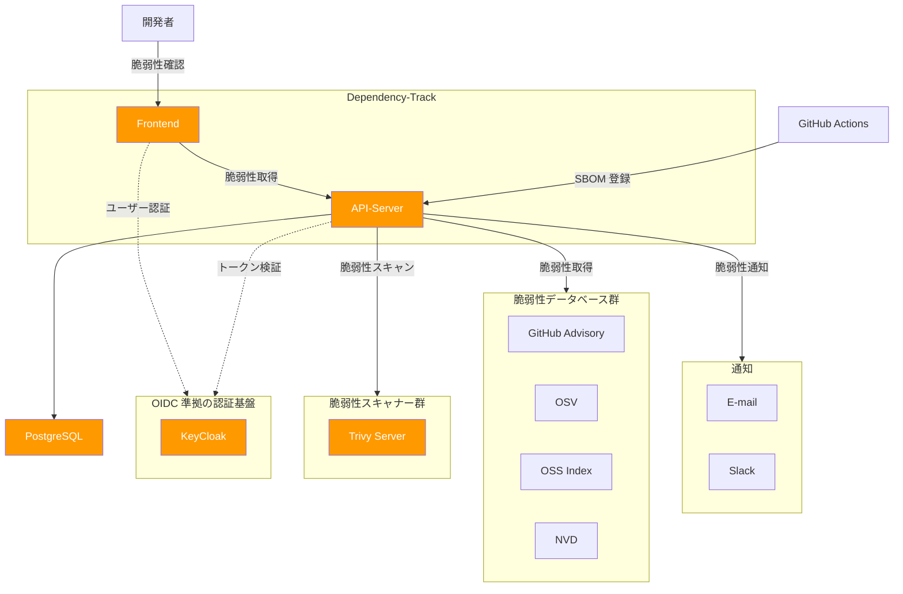

# Dependency-Track のローカル環境の構築手順書

このドキュメントでは、Dependency-Track の機能を確認するためのローカル環境の構築手順を説明します。

- 構築するローカル環境では、システムの負荷に応じて性能を柔軟に調整できません。
- 運用環境を構築する場合は、[AWS での Dependency-Track の構築手順](dt-setup-aws.md)を参照してください。

## ローカル環境でのシステム構成



ローカル環境では、Dependency-Track 以外に以下のサービスを起動します。
- PostgreSQL: DT の情報を保存する DB
- Trivy: 脆弱性スキャナー
- KeyCloak: OIDC 準拠の認証基盤

また、DT からインターネットを経由して脆弱性データベースを参照します。

## セットアップ

### 事前準備

1. Linux (Debian / Ubuntu) サーバを用意します
2. 用意したサーバに docker / docker compose 環境をセットアップします
   - [Docker 環境のセットアップ手順書](docker-installation.md)

### ローカル環境のセットアップ手順

- Windows の WSL (Ubuntu) を利用する場合: 
[他の端末からシステムにアクセスしない場合](#他の端末からシステムにアクセスしない場合)に進んでください
- AWS / Azure の VM にシステムを構築し、あなたの PC からシステムを利用する場合: 
[他の端末からシステムにアクセスする場合](#他の端末からシステムにアクセスする場合)に進んでください

### 他の端末からシステムにアクセスしない場合

`docker-compose/http` に移動し、[共通のセットアップ手順](#共通のセットアップ手順)に進んでください。

### 他の端末からシステムにアクセスする場合

#### 1. ポートの解放

他の端末からシステムにアクセスするために、サーバ上で以下のポートを開放してください。

- 8080: DT の Frontend UI にブラウザアクセスするため
- 8081: ブラウザにダウンロードした Frontend から API Server にアクセスするため
- 8443: ブラウザ操作で KeyCloak を利用して DT にログインするため

#### 2. Docker 設定の編集

1. `docker-compose/https` に移動します
2. `docker-compose.yaml` を開き、以下の環境変数に外部からアクセス可能な IP アドレスを設定します
   - ALPINE_OIDC_ISSUER
   - API_BASE_URL
   - OIDC_ISSUER
   
   IP アドレスが 20.243.192.236 である場合、以下のように設定します。
   ```
   # docker-compose.yaml

   # apiserver
   ALPINE_OIDC_ISSUER: "https://20.243.192.236:8443/realms/dtrack"

   # frontend
   API_BASE_URL: "http://20.243.192.236:8081"
   OIDC_ISSUER: "https://20.243.192.236:8443/realms/dtrack"
   ```

#### 3. 自己証明書の設定

1. `san.cnf` を編集します
   
   サーバの IP アドレスが 20.78.124.206 の場合、`CN` と `IP.1` に 20.78.124.206 を設定します。
   ```
   # san.cnf

   [dn]
   CN = 20.78.124.206

   [alt_names]
   IP.1 = 20.78.124.206
   ```

2. 以下のコマンドを実行し、自己証明書の作成と登録をします

   ```bash
   # 証明書と鍵の作成
   openssl req -x509 -newkey rsa:2048 -nodes -days 365 \
     -keyout tls.key -out tls.crt -config san.cnf

   # API サーバのデフォルト証明書ストアの取り出し
   cid=$(docker run -d --rm dependencytrack/apiserver:latest)
   docker cp "$cid:/opt/java/openjdk/lib/security/cacerts" ./cacerts
   docker stop "$cid"

   # 証明書ストアへ自己証明書の追加
   docker run --rm -it -v "$(pwd):/work" eclipse-temurin:11-jre \
     keytool -keystore /work/cacerts -storepass changeit \
     -noprompt -trustcacerts -importcert -alias keycloak-ca \
     -file /work/tls.crt
   ```

この後は、[共通のセットアップ手順](#共通のセットアップ手順)に進んでください。

### 共通のセットアップ手順

1. Dependency-Track の起動

   ```bash
   docker compose up -d
   ```

   初回起動時は、データベースの初期化とイメージのダウンロードに数分かかります。

2. 起動ログの確認

   ```bash
   docker compose logs -f apiserver
   ```

   `Dependency-Track is ready` というメッセージが表示されたら起動完了です。

3. ブラウザでの確認

   - システムと同じ端末からブラウザでアクセスする場合: http://localhost:8080
   - 他の端末からシステムにブラウザでアクセスする場合: http://{{ システムの IP アドレス }}:8080

   **初期ログイン情報**:
   - Username: `admin`
   - Password: `admin`

## 脆弱性データベースの設定

[脆弱性データベースの連携設定](dt-setup-vuln-db.md)を参照してください。

## 脆弱性スキャナーの設定

Dependency-Track は、Trivy などの他の脆弱性スキャナーの利用をサポートしています。

- 他の脆弱性スキャナーと連携させることで、脆弱性の検出精度が向上します
- スキャナーごとに脆弱性の検出が得意な領域が異なります
- プロジェクトの特性に合わせて、適切な脆弱性スキャナーを設定する必要があります

### Trivy の有効化手順

Dependency-Track に管理者権限でログインして、以下の設定をしてください。

1. `Administration` → `Analyzers` → `Trivy` をクリック
2. 以下を設定：
   - **Enable Trivy analyzer**: 有効
   - **Base URL**: `http://trivy:8082`
   - **API Token**: `docker-compose.yaml` の 環境変数 `TRIVY_TOKEN` の値: `trivy-token` を設定
3. `Update` をクリック

## OIDC 準拠の認証基盤との連携

KeyCloak を使う場合は、[KeyCloak 連携の手順書](oidc-setup-keycloak.md)を参照してください。

他の OIDC 準拠の認証基盤を使う場合、公式文書の[OpenID Connect Configuration](https://docs.dependencytrack.org/getting-started/openidconnect-configuration/)を参考に、`docker-compose.yaml` の環境変数を設定してください。

## API キーの作成

GHA (CI/CD パイプライン) から DT に SBOM を登録するためには、DT に API キーを作成する必要があります。

[API キーのセットアップ手順](dt-setup-apikey.md)を参考にしてください。

## 通知設定

プロジェクトの脆弱性や脆弱性対応の状況を迅速に通知したい場合、[通知設定手順](dt-setup-notification.md)を参考に設定してください。
